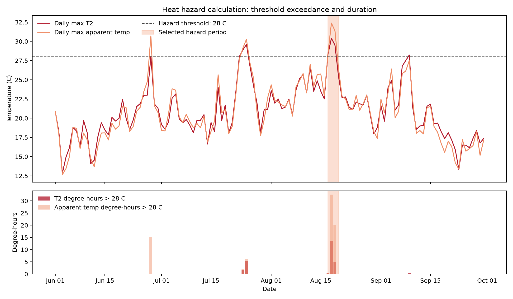
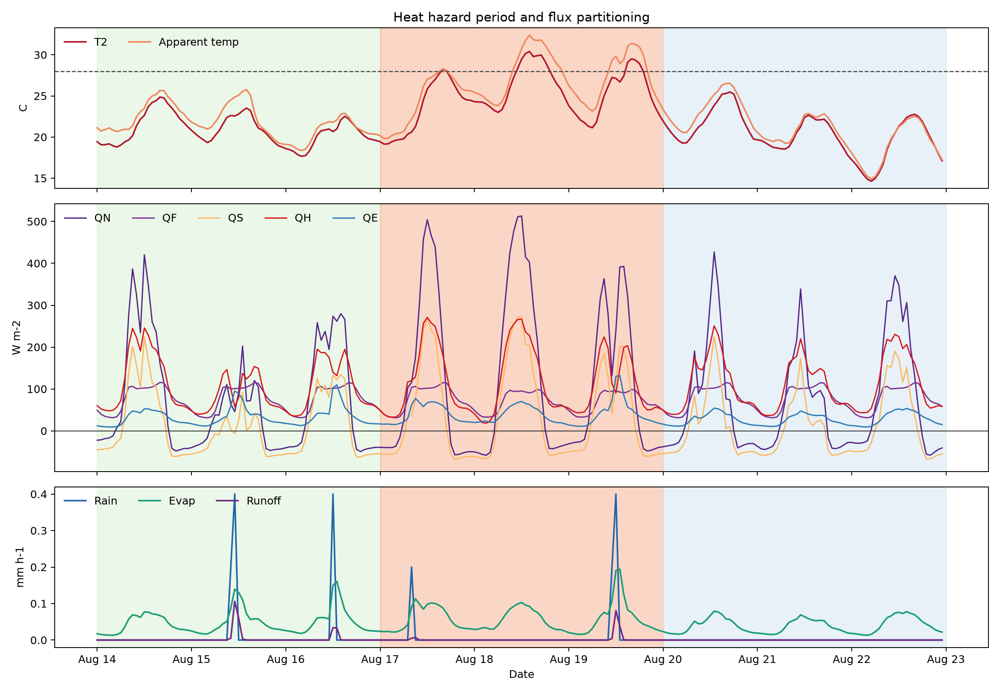
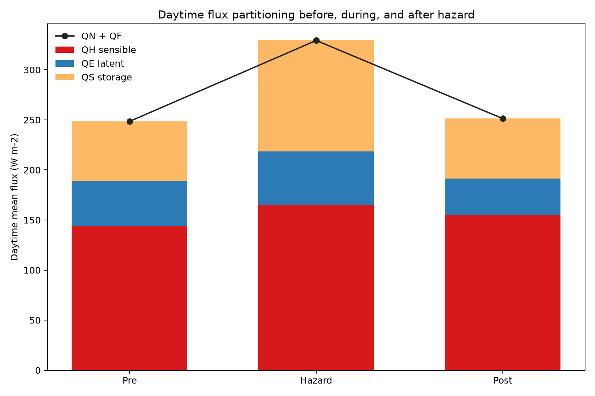

# Heat Hazard and Urban Flux Partitioning: SUEWS Practice Analysis

## Introduction

This page documents a practice workflow for the SUEWS Community Hackathon. The
exercise uses the bundled KCL/London `simple-urban` sample case to check that
SUEWS can be run end to end, then explores how a short heat-hazard period is
reflected in the modelled surface energy and water fluxes.

This is not the final hackathon-city analysis. It is a worked example showing
how the repository, model run, public documentation, and AI transcript evidence
can be organised before the real focus-city dataset is released.

## Objectives

The objectives of this exercise were to:

- Create a public practice repository from the hackathon template.
- Run one small SUEWS simulation to confirm the toolchain works.
- Calculate a simple heat-hazard metric from the hourly model output.
- Identify the main heat-hazard period in the sample year.
- Compare energy and water fluxes before, during, and after the hazard period.
- Clarify what the simulation can say about hazard, and what extra information
  is needed to estimate heat risk.

## Methods

The practice repository was created from `UMEP-dev/suews-hackathon-template`.
SUEWS/SuPy version `2026.6.5` was installed in a local Python environment, and
the bundled `simple-urban` sample configuration was initialised, validated, run,
diagnosed, and summarised.

The simulation used the packaged KCL/London sample configuration and hourly
meteorological forcing for 2012. The output file used for analysis was:

```text
analysis/demo-simple-urban/Output/KCL1_2012_SUEWS_60.txt
```

Heat hazard was calculated from hourly 2 m air temperature, `T2`, using a
transparent exceedance metric:

```text
degree-hours = sum(max(T2 - 28 C, 0))
```

Apparent temperature was also calculated to include humidity and wind effects:

```text
apparent_temperature = T2 + 0.33e - 0.70U10 - 4
```

where `e` is vapour pressure estimated from `T2` and `RH2`, and `U10` is 10 m
wind speed.

The heat-hazard period was selected as the longest run of days in the sample
with daily maximum `T2 >= 28 C`. This selected:

- Pre-hazard comparison period: 2012-08-14 to 2012-08-16
- Heat-hazard period: 2012-08-17 to 2012-08-19
- Post-hazard comparison period: 2012-08-20 to 2012-08-22

Flux partitioning was assessed using daytime mean fluxes, where daytime was
defined as `Kdown > 20 W m-2`. The main energy-balance terms compared were net
all-wave radiation `QN`, anthropogenic heat `QF`, storage heat `QS`, sensible
heat `QH`, and latent heat `QE`.

## Results and Discussion

### Objective 1: Confirm the SUEWS practice run

The practice workflow successfully produced an hourly SUEWS output file for the
bundled KCL/London sample case. The diagnostic summary found `3` passing checks,
`1` warning, and `0` failures. `QH`, `QE`, and `QN` all had `0%` missing values,
so the output was suitable for this interpretation exercise.

The remaining warning was an energy-balance closure diagnostic, so the results
should be treated as a practice analysis rather than a publication-ready model
assessment.

### Objective 2: Calculate a heat-hazard metric

The heat-hazard metric was based on hourly exceedance above `28 C`. Across the
selected event, `T2 >= 28 C` occurred for `14` hours and accumulated `18.5
C-hours` above the threshold.

Apparent temperature showed a stronger hazard signal. It exceeded `28 C` for
`25` hours and accumulated `53.1 C-hours` above the same threshold. This means
humidity and low wind made the event feel more severe than air temperature alone
suggests.

<p align="center">
  
  <br>
  <em>Figure 1. Heat-hazard identification using daily maximum T2, apparent temperature, and degree-hours above 28 C.</em>
</p>

### Objective 3: Identify the main heat-hazard period

The selected heat-hazard period was `2012-08-17` to `2012-08-19`, the longest
run of days in the sample year with daily maximum `T2 >= 28 C`. The peak
modelled `T2` during this period was `30.4 C`, and the peak apparent temperature
was `32.4 C`.

The comparison windows were chosen to be the same length as the hazard period:

- Pre-hazard: `2012-08-14` to `2012-08-16`
- Hazard: `2012-08-17` to `2012-08-19`
- Post-hazard: `2012-08-20` to `2012-08-22`

This keeps the before/during/after comparison balanced: each period contains
`72` hourly records and about `41-42` daytime hours, using `Kdown > 20 W m-2`.

### Objective 4: Compare flux partitioning before, during, and after heat hazard

The heat-hazard period had substantially higher daytime available energy.
Daytime `QN + QF` increased from `248.5 W m-2` before the event to `329.3 W
m-2` during it, then dropped back to `251.3 W m-2` after it.

The strongest partitioning change was storage heat. Daytime `QS` increased from
`59.2 W m-2` before the event to `110.6 W m-2` during the event. Sensible heat
`QH` increased from `144.1 W m-2` to `164.5 W m-2`, while latent heat `QE`
increased only modestly from `45.2 W m-2` to `54.1 W m-2`.

| Period | Daytime QH | Daytime QE | Daytime QS | Daytime QN + QF |
| --- | ---: | ---: | ---: | ---: |
| Pre-hazard | 144.1 | 45.2 | 59.2 | 248.5 |
| Hazard | 164.5 | 54.1 | 110.6 | 329.3 |
| Post-hazard | 154.7 | 36.6 | 59.9 | 251.3 |

As daytime fractions of `QH + QE + QS`, the hazard period partitioned about
`50.0%` to sensible heat, `16.4%` to latent heat, and `33.6%` to storage heat.
The storage fraction was higher than both the pre-hazard (`23.8%`) and
post-hazard (`23.8%`) periods.

<p align="center">
  
  <br>
  <em>Figure 2. Hourly temperature, energy fluxes, and water fluxes for the pre-hazard, hazard, and post-hazard windows.</em>
</p>

<p align="center">
  
  <br>
  <em>Figure 3. Daytime mean flux partitioning, showing the rise in storage heat during the hazard period.</em>
</p>

The key interpretation is that the heat-hazard period was not only hotter in
the air. The urban surface also stored much more heat. This matters because
stored heat can be released later, helping to sustain warm evening and night
conditions. In this sample case, the extra available energy was partitioned
mainly into storage and sensible heating rather than evaporation.

### Objective 5: Clarify the hazard-to-risk boundary

The simulation provides a heat-hazard layer, but it does not provide a complete
heat-risk assessment. Risk also needs exposure, vulnerability, and adaptive
capacity information. A simple structure for later processing is:

```text
risk_index = hazard_index * exposure_index * vulnerability_index *
             (1 - adaptive_capacity_index)
```

Useful non-SUEWS indicators for the final hackathon task include population
exposed, age structure, deprivation or low-income share, outdoor-worker share,
housing quality, baseline health vulnerability, access to cooling, and
green/blue-space access.

## Conclusion

This practice run confirms that the SUEWS workflow can produce hourly urban
climate outputs and that these outputs can be converted into a transparent heat
hazard metric. The selected hazard period showed higher air temperature, higher
apparent temperature, and a clear shift in flux partitioning, especially a large
increase in storage heat.

For the final hackathon submission, the same workflow should be repeated with
the released focus-city dataset. The hazard result should then be combined with
population and socio-economic indicators to produce a heat-risk indicator, with
the assumptions and limitations stated clearly.

## Citation

This practice run used SUEWS/SuPy version `2026.6.5`. The final hackathon
submission should cite the exact software version used, following the current
[SUEWS citation guidance](https://docs.suews.io/stable/#how-to-cite-suews).

Core model references:

- Jarvi, L., Grimmond, C.S.B. and Christen, A. (2011). The Surface Urban Energy
  and Water Balance Scheme (SUEWS): Evaluation in Los Angeles and Vancouver.
  *Journal of Hydrology*, 411(3-4), 219-237.
  [https://doi.org/10.1016/j.jhydrol.2011.10.001](https://doi.org/10.1016/j.jhydrol.2011.10.001)
- Ward, H.C., Kotthaus, S., Jarvi, L. and Grimmond, C.S.B. (2016). Surface
  Urban Energy and Water Balance Scheme (SUEWS): Development and evaluation at
  two UK sites. *Urban Climate*, 18, 1-32.
  [https://doi.org/10.1016/j.uclim.2016.05.001](https://doi.org/10.1016/j.uclim.2016.05.001)
